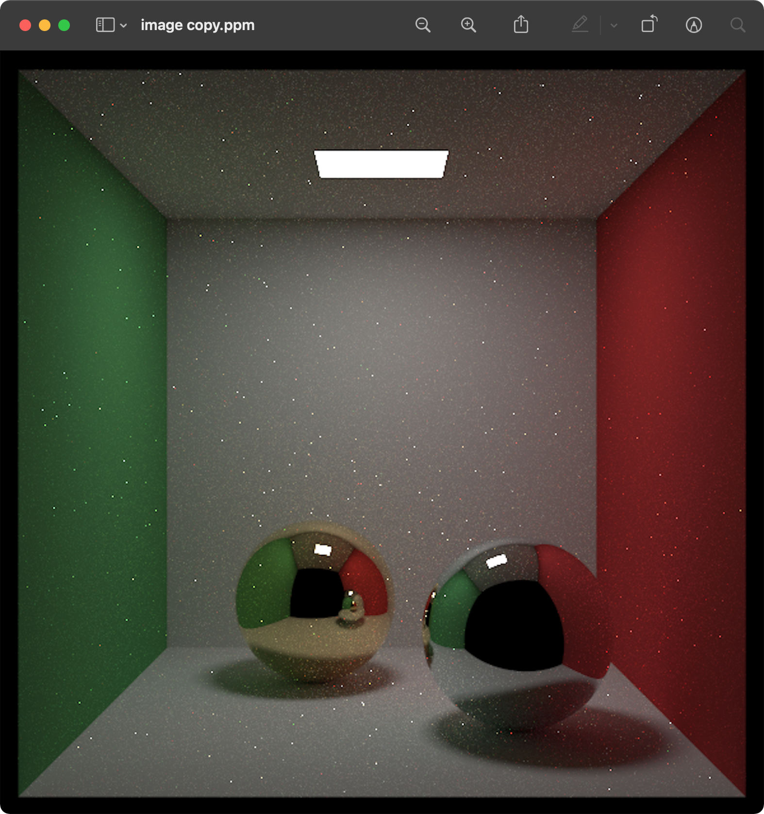
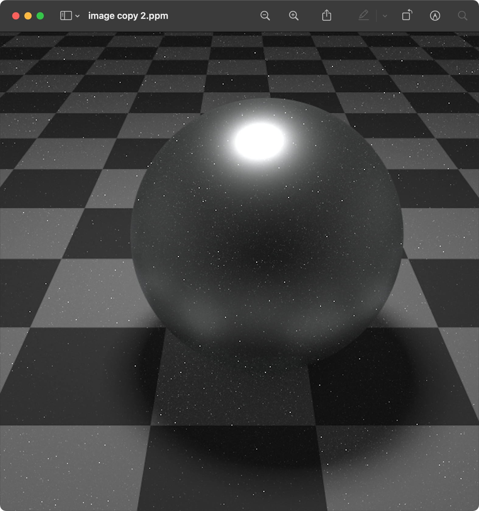
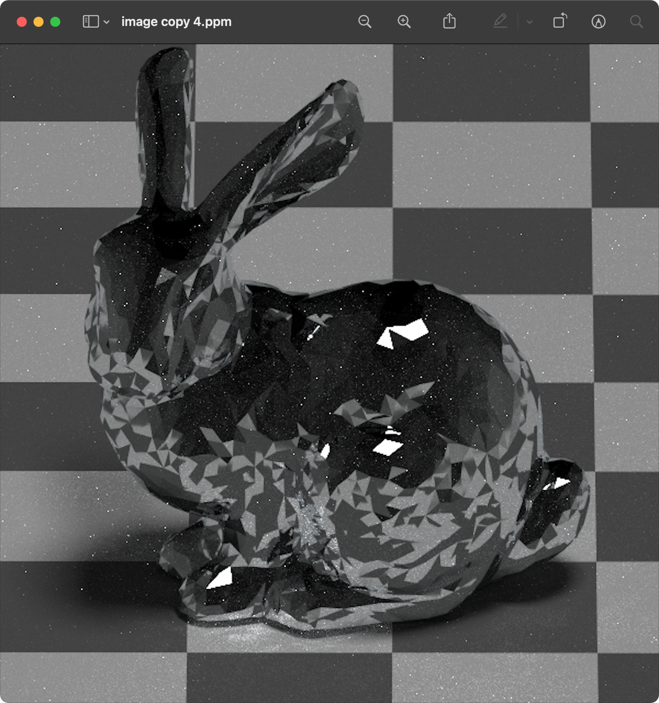
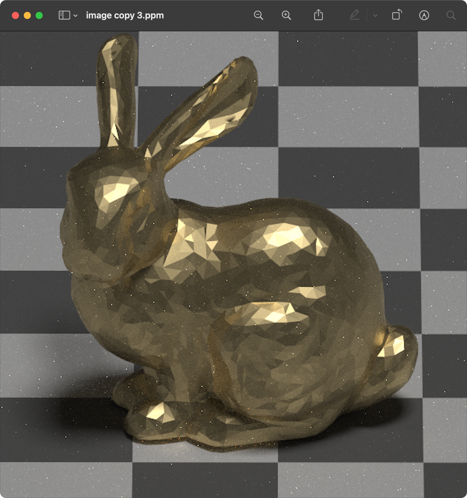

# Renderer

This renderer is based on [_Ray Tracing in One Weekend Series_](https://raytracing.github.io/), the features in this book series are implemented and I plan to add more features to it while reading [_Physically Based Rendering_](https://www.pbr-book.org/3ed-2018/contents), so it is still in development and it will be a long-lasting project.

## How to build this project?

* install **cmake**
* open your terminal, go to the project directory

```
mkdir build
cd build
cmake ..
make
./Renderer
```

## Selected Images










